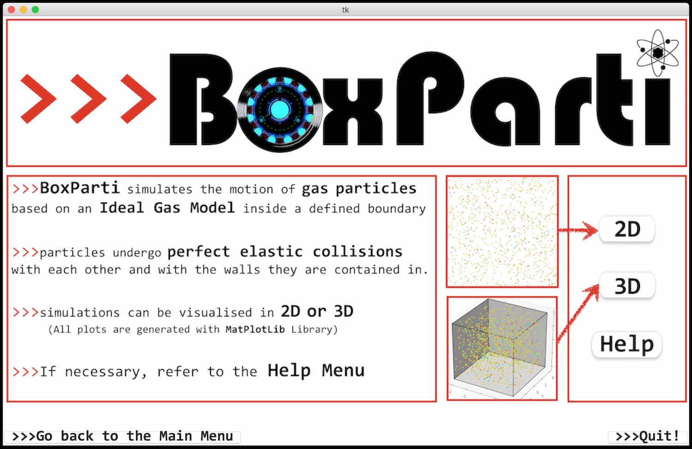
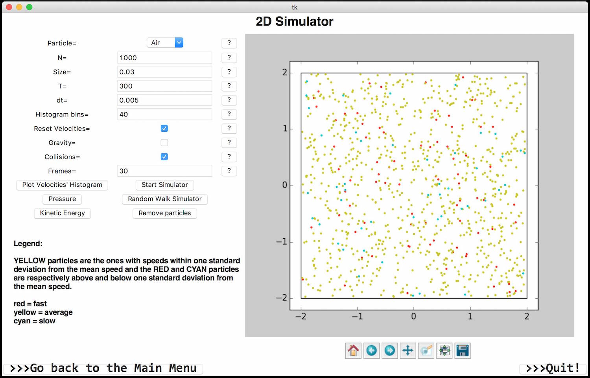
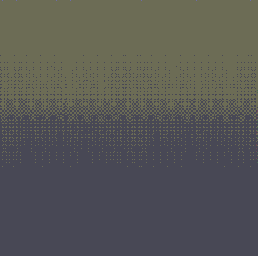
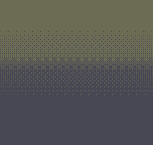
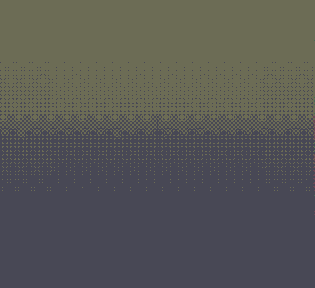

### TODO!
- requirements.txt
-- matplotlib
-- scipy
-- etc

# BoxParti

_Welcome to my first programming project._

_Enjoy!_

This was a project for a Scientific Computing Skills module in my Physics undergraduate. It is a Tkinter GUI running a **hard sphere molecular dynamics model simulation**.

I have noticed that this version **performes better on OS X**. With minor changes it can also run on Linux and Windows. 

### If running on Linux:
I have only tested this on Ubuntum. But the WelcomePage() class in [BoxParti.py](BoxParti.py) should only be using the **pack** or **grid** methods. This would actually be the correct way of doing it, according to Tkinter documentation! Some work to be done there...

## 4. Gallery
#### The HomePage/WelcomePage

#### The 2D Simulator Page

#### 2D Simulation with collisions

#### 3D Simulation with collisions and gravity

#### 2D Brownian Motion

#### Maxwell-Boltzmann Speed Distribution

**Tomás Pereira de Vasconcelos**

tomasvasconcelos1@gmail.com 
