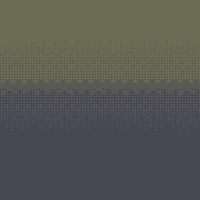

**Deprecated** - I have expanded this project into [mdsea](https://github.com/TPVasconcelos/mdsea), a python molecular dynamics simulation engine with 2D and 3D animation rendering.

---

# BoxParti

_"My first programming project."_

I developed this project for a "Scientific Computing Skills" module in the first year of my Physics Undergraduate degree. It is a Tkinter GUI running a **hard-sphere molecular dynamics simulation**.

This was developed on macOS and I've noticed that the GUI does not render so well on Linux and Windows machines. This could be fixed and will be _"left as an exercise for the reader"_. \[**Hint:** The `WelcomePage()` class in [BoxParti.py](BoxParti.py) should only use the **pack** or **grid** methods (not both). This would actually be the correct way of doing things, [according to the Tkinter documentation](http://effbot.org/tkinterbook/grid.htm).\]

## Some snapshots of the interface and simulations:

#### The HomePage/WelcomePage

#### The 2D Simulator Page

#### 2D Simulation with collisions

#### 3D Simulation with collisions and gravity

#### 2D Brownian Motion

#### Maxwell-Boltzmann Speed Distribution

